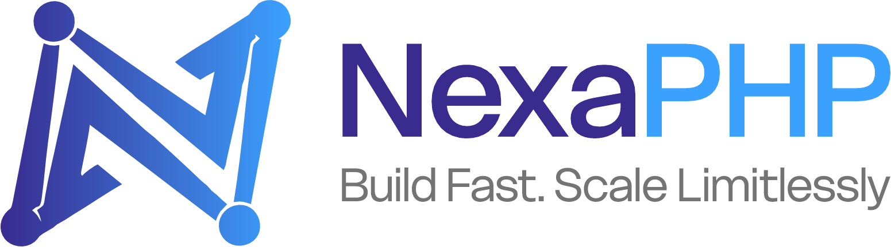

<p align="center">
  
</p>

# NexaPHP Framework
> **"Build Fast. Scale Limitlessly."**

NexaPHP is a next-generation, high-speed PHP framework designed for modern, scalable web applications. Built with a developer-first mindset, NexaPHP provides a clean architecture, modular structure, and powerful tools to bridge the gap between simplicity and enterprise-grade performance.

---

### [NEW] Install via Composer
To start a new NexaPHP project instantly, run:

```bash
composer create-project hwebtech/nexa my-new-app
```

---

### Core Value Propositions
- **Performance First:** Engineered for speed with single-digit millisecond overhead.
- **Total Flexibility:** No rigid ORM rules or complex configurations -- code your way.
- **Enterprise Security:** Hardened core with CSP, HSTS, and XSS protection out of the box.
- **Scalable Architecture:** Built-in Service Container and Middleware for infinite growth.
- **Nexa CLI Tool:** A dedicated high-performance terminal tool for rapid development.

---

### Technical Highlights
- **Service Container:** Deep dependency injection for modular software design.
- **Express-style Routing:** Fluent routing engine with recursive middleware and route grouping.
- **Lightweight Query Builder:** Speed-optimized, chainable database queries.
- **Secure Authentication:** Native Auth helper for sessions and password verification.
- **CLI Powerhouse:** Scaffold controllers, models, views, and migrations with the `nexa` tool.

---

### Manual Installation
If you prefer to clone the repository manually for contribution or research:

1. **Clone the repository:**
   ```bash
   git clone https://github.com/hwebtech/nexaphp.git
   cd nexaphp
   ```

2. **Install dependencies:**
   ```bash
   composer install
   ```

3. **Configure Environment:**
   ```bash
   cp .env.example .env
   php nexa key:generate
   ```

4. **Launch Server:**
   ```bash
   php nexa serve
   ```

---

### Nexa CLI Commands
Maximize your productivity with a professional suite of terminal tools:

**General Usage**
- `php nexa help` -- List all available commands
- `php nexa about` -- Display framework information
- `php nexa serve [PORT]` -- Start development server (default: 7272)

**Database & Configuration**
- `php nexa migrate` -- Apply database migrations
- `php nexa key:generate` -- Generate application secure key
- `php nexa env:example` -- Synchronize .env and .env.example

**Scaffolding (Rapid Development)**
- `php nexa make:controller NAME` -- Scaffold a new controller
- `php nexa make:model NAME` -- Scaffold a new model
- `php nexa make:middleware NAME` -- Create a new middleware
- `php nexa make:migration NAME` -- Create a new migration file
- `php nexa make:view NAME` -- Create a new view file

**Application Management**
- `php nexa route:list` -- Map your entire application routes
- `php nexa clear:logs` -- Delete all log files
- `php nexa down` -- Enter maintenance mode
- `php nexa up` -- Exit maintenance mode
---

### Project Vision
**Vision:** To empower developers to build fast, secure, and maintainable web applications using a simple yet powerful PHP framework.

**Mission:** To provide a modern PHP development experience that prioritizes performance and flexibility without the bloat of traditional frameworks.

---
**NexaPHP — Build faster. Scale smarter.**
*© 2026 H-Web Technologiees Limited. All Rights Reserved.*
